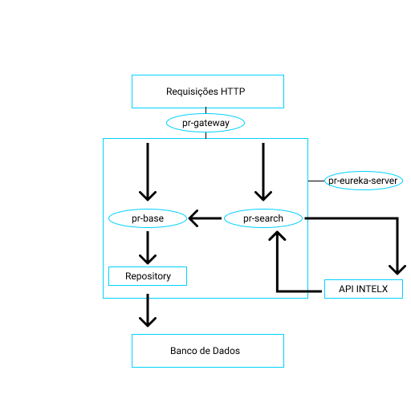
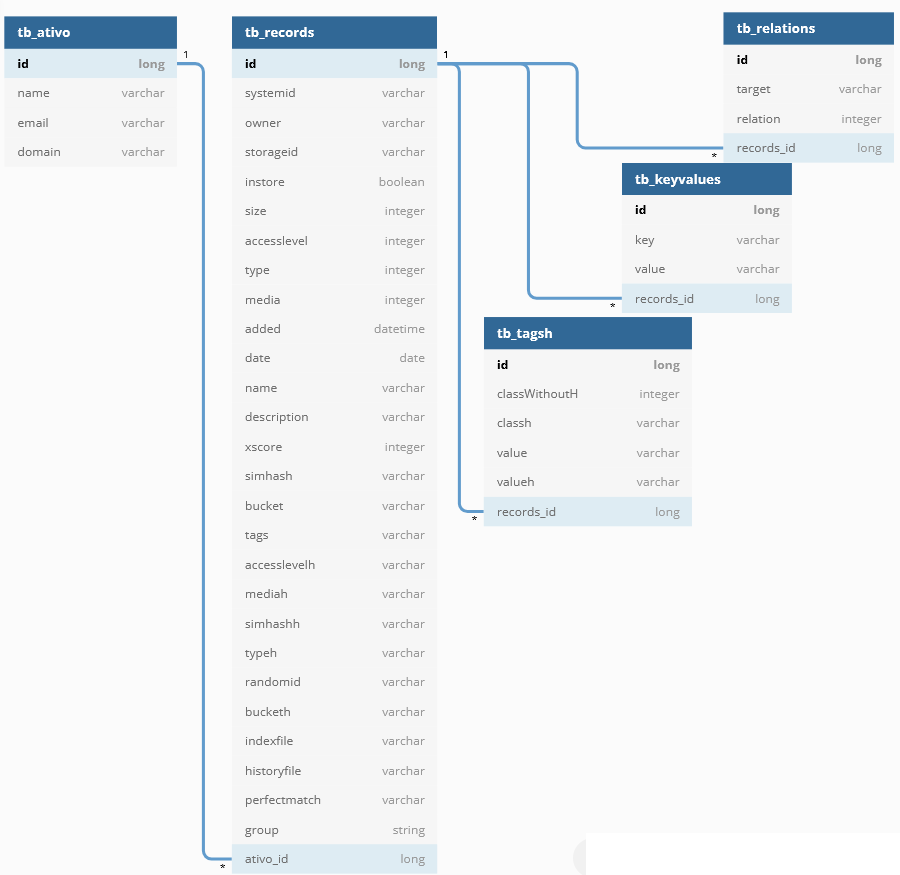

# Backend

Ilustrações referente à Arquitetura e modelagem do BD no final do README.

## Arquitetura

O projeto é um *Microservice* que contém 4 projetos, cada um responsável por um conjunto de coisas.

Temos os seguintes projetos: 

- **pr-base**: responsável pelos Endpoints do ***CRUD*** de *Ativo*, pelo Endpoint de *Busca* de dados vazamentos presentes no Banco de Dados do Ativo cadastrado, pelo mapeamento das Classes de Modelo do Banco de Dados (diagramas abaixo) pelos *Repositories* de todo o projeto e pela regra de negócio do cadastro de Ativos.
- **pr-search**: responsável por fazer Requisições HTTP no serviço da *INTELX* e no projeto *pr-base* a fim de armazenar informações sobre o vazamentos do Ativo pesquisado (esse projeto também detém a chave da API da INTELX).
- **pr-eureka-server**: responsável por ser o Servidor Eureka da aplicação.
- **pr-gateway**: responsável por mapear as rotas de todos os Endpoints da aplicação.

## Documentação

**Obs:** a classe Records possui todos os campos que o Endpoint `https://2.intelx.io/intelligent/search/result?id=` da API INTELX responde.

Endpoints do *CRUD* de **Ativo**:

- **http://localhost:8080/ativos** -> GET = Recebe um Pageable como parâmetro (page, size) / Retorna um Page de AtivoDto
- **http://localhost:8080/ativos/{id}** -> GET = Recebe um ID pela URL / Retorna um AtivoDto. Lança ObjectNotFound
- **http://localhost:8080/ativos/email?email=** -> GET = Recebe um Email por parâmetro / Retorna um AtivoDto. Lança ObjectNotFound
- **http://localhost:8080/ativos/domain?domain=** -> GET = Recebe um Domain por parâmetro / Retorna um AtivoDto. Lança ObjectNotFound
- **http://localhost:8080/ativos** -> POST = Recebe um AtivoDto no Body. Insere no BD / Retorna um ResponseEntity de AtivoDto
- **http://localhost:8080/ativos/{id}** -> PUT = Recebe um AtivoDto no Body e um ID na URL. Atualiza no BD / Retorna 204 No Content
- **http://localhost:8080/ativos/{id}** -> DELETE = Recebe um ID na URL. Deleta no BD / Retorna 204 No Content

Endpoints de *BUSCA* por dados de vazamento do **Ativo** cadastrado:

- **http://localhost:8080/search?ativoId=&pattern=** -> GET = Recebe um ID e um Domain OU Email de um *Ativo* cadastrado como parâmetro / Retorna uma Lista de Records | Esse Endpoint fará uma requisição na API da INTELX e irá armazenar todos os dados da *resposta* no Banco de Dados através de um Request no projeto **pr-base**. Se o ID informado não pertencer a nenhum Ativo, uma exceção será executado

Endpoints de *BUSCA* por dados coletados de vazamento de **Ativo** cadastrado:

- **http://localhost:8080/records/{id}** -> GET = Recebe um ID de um *Ativo* cadastrado na URL / Retorna uma Lista de Records

Endpoint utilizado para armazenar todos os dados de monitoramento de *Ativos* cadastrados. Recebe requisições do projeto *pr-search*.

- **http://localhost:8080/records** -> GET = Recebe um ***JSON Serializado*** de String com campos de **Records** / Retorna uma Lista de Records

### Bibliotecas externas

- Gson (para serialização de objetos Records)
- Lombok (para melhor utilização dos campos da classe Record)

### Ilustrações

Diagrama do Banco de dados:

